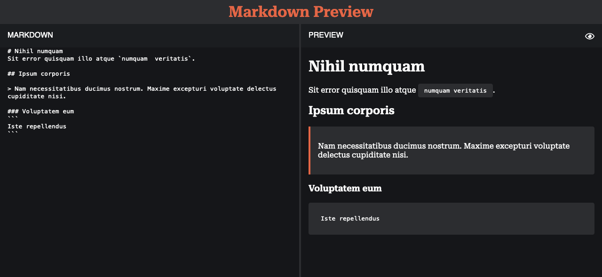

# Markdown Preview

This is a simple markdown previewer with a responsive design.



## How To Use

```bash
git clone https://github.com/tomwf/markdown-preview.git
```
Navigate into the directory:
```bash
cd markdown-preview
```
Install the dependencies:
```bash
npm i
```
Run the local dev environment:
```bash
npm start
```
Open your browser and visit:
```
http://localhost:3000
```

## Link

Live Demo: [Markdown Preview](https://tomwf-markdown.vercel.app/)
